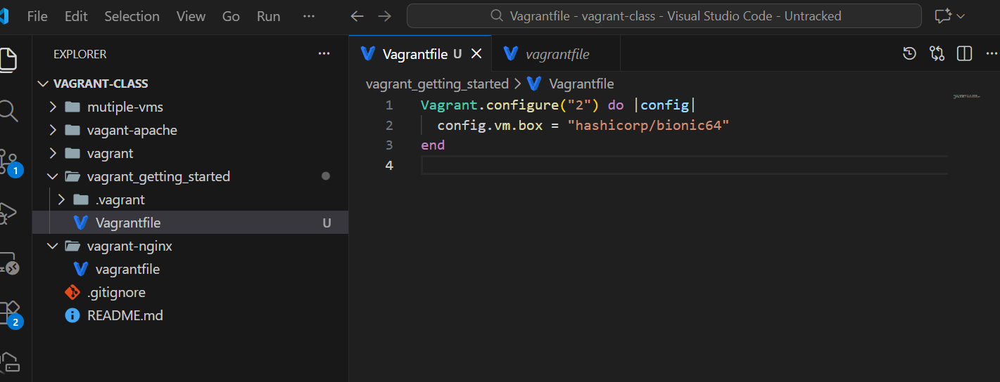
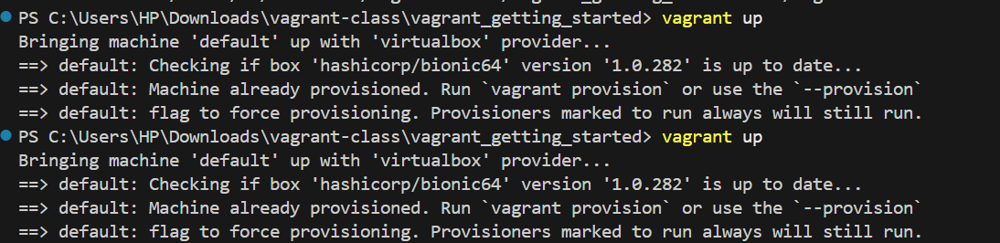
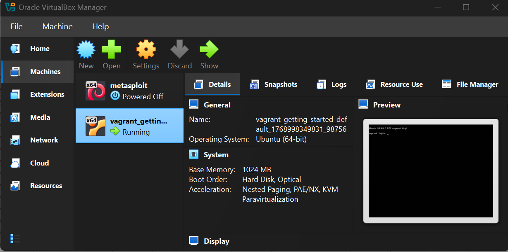

# Lab Report: Getting Started with Vagrant

In this lab, I installed and configured Vagrant and used it to create and run a virtual machine (VM)us ing Oracle VirtualBox I created a Vagrant project folder, initialized it, edited the Vagrantfile to use an Ubuntu box, started the VM, connected to it using SSH, and then safely shut it down.

Tools used:
- Vagrant  
- Oracle VirtualBox  
- VS Code (Terminal)
- git bash 
- windows terminal

Before I started, I confirmed that I had:
- A working computer (Windows OS)
- Internet connection
- Oracle VirtualBox installed
- Vagrant installed


## Step 1: Install Vagrant
1. I visited the official Vagrant download page and downloaded the correct installer for my operating system.  
2. I installed Vagrant using the default settings.  
3. After installation, I restarted my computer (recommended on Windows so environment variables update).


## Step 2: Verify Vagrant Installation
I opened  windows terminal  and  I typed the following command to verify Vagrant is installed:

```powershell
vagrant
```

I confirmed that Vagrant displayed a list of available commands (like `init`, `up`, `halt`, `destroy`).


## Step 3: Create a Project Directory
 In the VS Code terminal, I navigated to the location where I wanted to create my project folder (my downloads) then I created a directory named vagrant_getting_started at git bash

```
mkdir vagrant_getting_started
```

I moved into the directory:

```
cd vagrant_getting_started
```

I confirmed I was in the correct folder.


## Step 4: Initialize the Vagrant Project
Inside the `vagrant_getting_started` folder, I initialized Vagrant:

```
vagrant init
```

This created a file named **Vagrantfile**, which is used to configure the VM.


## Step 5: Configure the Vagrantfile
 I opened the **Vagrantfile** in VS Code and  replaced its contents with the following configuration:

```
Vagrant.configure("2") do |config|
  config.vm.box = "hashicorp/bionic64"
end
```

3. I saved the file.

This configuration tells Vagrant to use the Ubuntu box **hashicorp/bionic64**.



## Step 6: Start the Virtual Machine
Before starting the VM, I ensured **Oracle VirtualBox** was installed and available.  
 
 In the same directory (`vagrant_getting_started`), I started the VM using:

```
vagrant up
```
at the VS code terminal 

I waited while Vagrant downloaded the box and created the VM.




## Step 7: Access the Virtual Machine (SSH)
1. After the VM started successfully, I logged into it using SSH:

```
vagrant ssh
```

I confirmed I was inside the Ubuntu VM when I saw the Linux welcome message and a prompt similar to `vagrant@...:$`.


3. To exit the VM  at the VS code terminal terminal, I typed:

```
exit
```

---

## Step 8: Stop the Virtual Machine
 After finishing my work in the VM, I shut it down safely (without deleting it) using:

```
vagrant halt
```

2. This stopped the VM but kept it available for later use.





## Conclusion
In this lab, I successfully:
- Installed Vagrant  
- Verified the installation using the terminal  
- Created a Vagrant project directory  
- Initialized Vagrant and generated a Vagrantfile  
- Configured the Vagrantfile to use `hashicorp/bionic64`  
- Started the VM using `vagrant up`  
- Connected to the VM using `vagrant ssh`  
- Exited the VM using `exit`  
- Shut down the VM safely using `vagrant halt`
